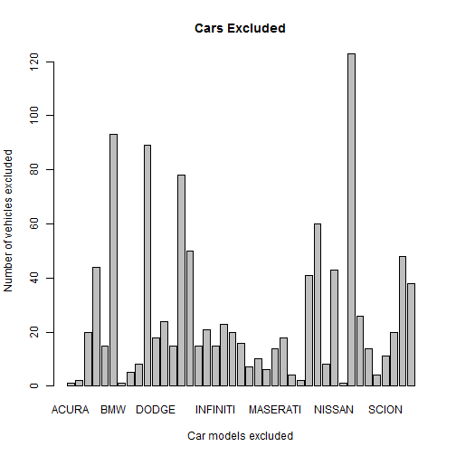

Slidify presentation for Developing Data Products
===
author: Yuriy V
date: March  07, 2016

Course Project, JHU via Coursera.com

Main menu
========================================================

* __Temperature Converter__: Fahrenheit  to  Celcius  converter  example:


```r
# User enters 100 Fahrenheit(e.g.) in the GUI and the calculation executes a formula...

App_input <- 100
round((App_input-32)*5/9,2)
```

```
[1] 37.78
```


Main menu (cont'd)
========================================================

* __Trip Estimator__: allows  the  user  to  calculate  a  road  trip  taken  by  car:
  
    - Choose your travel distance (*default at 50 miles*)
    - Select the type of your vehicle (*'MIDSIZE CARS' for example*)
    - Set the expected fuel price (*default at $1.90*)


```r
# Average MPG for 'MIDSIZE CARS' is 25.5 MPG
DIST <- 50; MPG <- 25.5; GAS_PRICE <- 1.90
# The formula then calculates the total trip cost as DIST/MPG * GAS_PRICE
```
    The Trip Cost is $3.73


Plot of Cars excluded from the Trip Estimator for various reasons
========================================================

 
